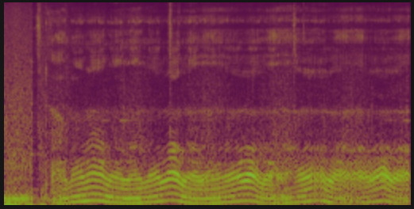
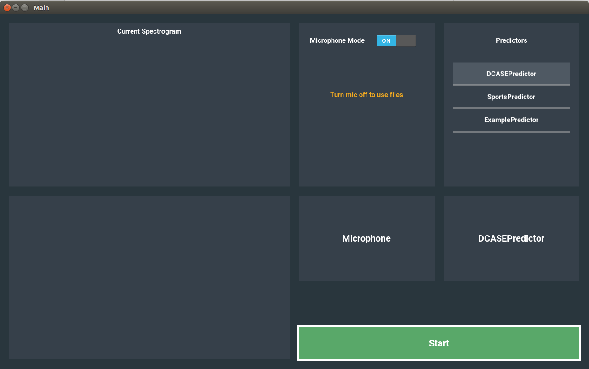
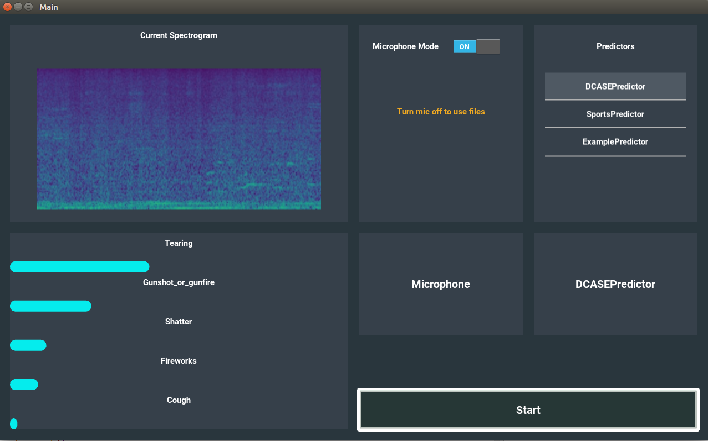

# AudioTagger

This project provides components for predicting audio input and showing its corresponding spectrogram representation. The repository contains a backend and a sample frontend Kivy - App which periodically calls the backend REST endpoints for prediction and spectrogram updates. 

## Packages

[/server](server)  
&nbsp;&nbsp;&nbsp;&nbsp; directory containing all backend components  
[/viewer](viewer)   
&nbsp;&nbsp;&nbsp;&nbsp; directory with a sample python GUI  

## Installation
Use Python 3 and Anaconda in order to get the code running for guarantee!  
Version used during development: ```3.6.7```

1. ```python setup.py develop```
2. Execute conda environment.yaml

## Usage
The current predictions and spectrograms can be accessed via a REST interface.
Following command starts the backend: 

```bash
python server/webserver.py
```

### REST interface
In order to guarantee independence of programming languages, all output can be accessed by calling URL endpoints. 


#### Get current spectrogram
|  |  |
| ----------- | --------- |
| Http-Method | ```GET``` |    
| Response Content-Type | ```JPEG``` |   
| URL |```http://127.0.0.1:5000/live_spec``` |
| Return | a JPEG from the current spectrogram |

There is an additional endpoint to display the current spectrogram in the browser:
```bash
http://127.0.0.1:5000/live_spec_browser
```
Example output: 
<p align="center">
  
</p>

#### Get current prediction
|  |  |
| ----------- | --------- |
| Http-Method | ```GET``` |    
| Response Content-Type | ```JSON``` |   
| URL |```http://127.0.0.1:5000/live_pred``` |
| Return | 2D array of most current class probabilities with respect to the currently selected predictor |
 
Example response: ```[["Acoustic_guitar", 0.0006955251446925104, 0], ["Applause", 0.0032770668622106314, 1], ...]```   
```1. element```: category name  
```2. element```: probability of prediction for this class
```3. element```: positional argument (can be used to if special order of displayed classes is desired)   

#### Get available audio files
|  |  |
| ----------- | --------- |
| Http-Method | ```GET``` |    
| Response Content-Type | ```JSON``` |   
| URL |```http://127.0.0.1:5000/source_list``` |
| Return | the available audio files as a list of json objects |

Example response: ```[{"id": 0, "displayname": "Trumpets"}, {"id": 1, "displayname": "Song1"}, {"id": 2, "displayname": "Song2"}, ...]```   
#### Get available predictors
|  |  |
| ----------- | --------- |
| Http-Method | ```GET``` |    
| Response Content-Type | ```JSON``` |   
| URL |```http://127.0.0.1:5000/pred_list``` |
| Return | the available prediction models as a list of json objects | 

Example response: ```[{"id": 0, "displayname": "DCASEPredictor", "classes": "41", "description": "sample description for dcase"}, {"id": 1, "displayname": "SportsPredictor", "classes": "3", "description": "sample description for detecting sports"}, ...]```  
#### Change audio input source and predictor  
The audio tagger backend implements another endpoint to change the audio source as well as the currently active prediction model on the fly.  

|  |  |
| ----------- | --------- |
| Http-Method | ```POST``` |    
| Request Body | ```JSON``` |   
| URL |```http://127.0.0.1:5000/settings``` |

Example request body: ```{'isLive': 1, 'file': 0, 'predictor': 1}``` where  
```isLive```: 1 -> true, 0 -> false  
```file```: id of the selected file  
```predictor```: id of the predictor  

### Adding predictors
One can add new predictors by editing the CSV-file [predictors.csv](server/config/predictors.csv).
#### Steps for building predictor wrapper
The next few steps show how to integrate a predictor into the backend system of the audio tagger:  
1. Extend predictors.csv with the properties of the new predictor  
    * Important note: Make sure that the given path in column ```predictorClassPath``` correctly identifies the path to the wrapper class. Otherwise, the backend cannot find the new predictor. There are already 3 predictors included. Have a look at this.
2. Implement a predictor such that it inherits from ```IPredictor``` ([see here](server/predictor/IPredictor.py)) 
3. Call base class constructor!

    * parameter ```probabilities```: ```[["class1", 0.0006955251446925104, 0], ["class2", 0.0032770668622106314, 1], ...]```   
```1. element```: category name  
```2. element```: probability of prediction for this class  
```3. element```: positional argument (can be used to if special order of displayed classes is desired)  

### Adding audio files
One can equip the backend with new selectable WAV files by editing the CSV-file [sources.csv](server/config/audiofiles.csv).  
The csv-file is of the following form:
```
id;displayname;path  
0;ExampleFile1;pathToWAVfile/file1.wav  
1;ExampleFile2;pathToWAVfile/file2.wav  
2;ExampleFile3;pathToWAVfile/file3.wav  
``` 

## Example GUI
The [/viewer](viewer) directory contains a sample GUI for the audio tagger backend. The app is based on the Python framework Kivy. GUI startup can be easily performed with the following command:  

```python viewer/startup.py```  

Important: The GUI requires a started instance of ```server/webserver.py``` to start up.

<p align="center">
  
  
</p>

## Support
Please contact the Institute for Computational Perception at Johannes Kepler University in Linz for questions regarding usage and code.

## License
TODO
